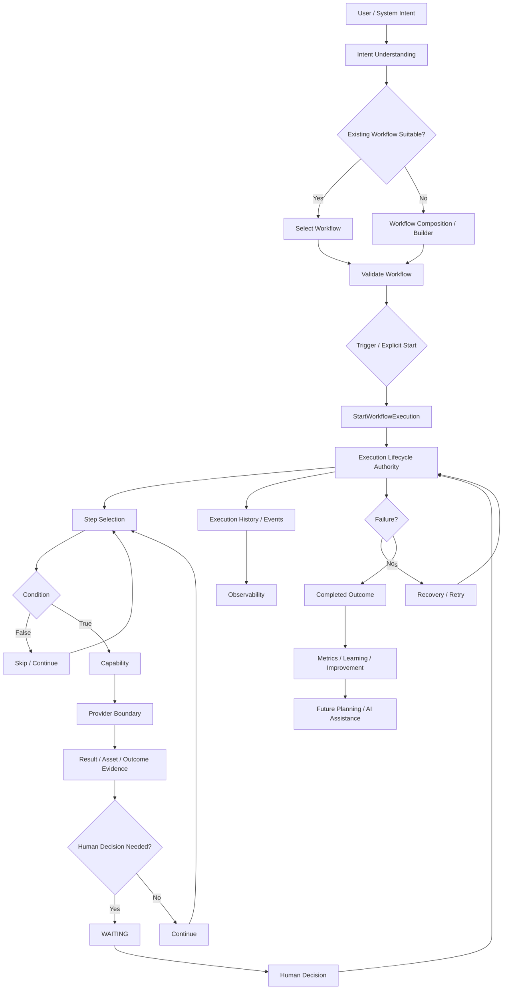
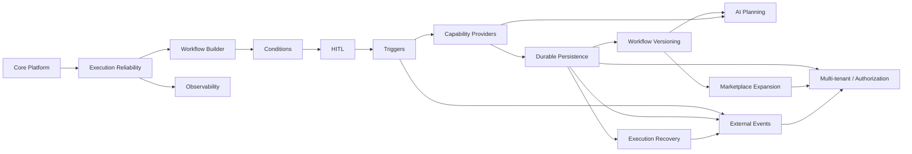

# Automation OS — Master Roadmap and Delivery Plan

Status: **ACTIVE — roadmap realigned to current architecture and capability sequence**

## 1. Purpose

This document is the current high-level roadmap for Automation OS.

It connects:

- the product destination;
- the current architectural baseline;
- the execution workflow;
- the capability sequence;
- dependencies;
- explicit non-goals;
- milestone exit criteria.

It does not replace individual Design Gates or ADRs. Those remain authoritative for significant decisions inside each capability.

---

## 2. Product Destination

Automation OS is being developed as a modular automation platform that turns a business/user intent into a validated, executable, observable workflow.

The long-term platform flow is:

`Intent → Understand → Plan → Compose → Validate → Trigger → Execute → Observe → Recover → Improve`

with:

`AI = replaceable planning/tooling`

and:

`Execution + deterministic domain rules = platform authority`

The platform should eventually support multiple domains, capabilities, providers, triggers, workflow versions, marketplace artifacts, external events, and isolated tenants without making any single provider or AI model the architectural center.

---

## 3. Current Architecture Baseline

### Established

- Intent analysis and canonical goals
- Workflow definition and composition
- Deterministic workflow validation
- Condition / decision evaluation
- Execution lifecycle
- Start / resume / cancel / retry boundaries
- Workflow discovery
- Workflow generation boundaries
- Marketplace discovery/publication/installation foundations
- Execution history and structured lifecycle evidence
- PostgreSQL durable execution persistence
- Immutable WorkflowVersion artifacts and execution-to-version traceability
- Execution recovery with conditional stale-state transitions
- Workflow-start idempotency
- Atomic in-memory coordination for concurrent idempotent starts
- Human decision request / decision boundary
- Explicit Design Gates and exit reviews

### Important limitation

The current atomic idempotency guarantee is verified for the in-memory persistence model. Durable persistence still needs an equivalent transaction/atomic persistence primitive before it can claim the same production contract.

---

## 4. Logical End-to-End Workflow



### Architectural rule

Trigger detection, workflow composition, capability execution, human decisions, recovery, and AI planning are separate boundaries. The execution aggregate remains the lifecycle authority.

---

## 5. Capability Roadmap

| Phase | Capability | Current status | Main purpose | Depends on |
|---|---|---|---|---|
| 1–6 | Core platform generalization | Completed | Establish intent/workflow/execution/marketplace foundations | — |
| 7 | Execution Reliability | Completed + hardened | Idempotency, history, lifecycle evidence, failure semantics | Core execution |
| 8.1 | Workflow Composition / Builder | Completed | Programmatic workflow construction boundary | Workflow model |
| 8.2 | Condition / Decision Engine | Completed | Deterministic conditional behavior | Workflow composition |
| 8.3 | Human-in-the-Loop | Completed + CI verified | Explicit human control points | Execution lifecycle |
| 8.4 | Scheduling / Triggers | Completed | Trigger matching and invocation boundary | Workflow + reliable start |
| 8.5 | Capability Provider System | Completed | Provider-independent capability execution | Stable workflow/capability boundary |
| 8.6 | Durable Persistence | Completed | Durable production state and atomicity | Existing repository contracts |
| 8.7 | Execution Recovery | Completed | Recover stale executions safely | Durable persistence |
| 8.8 | Workflow Versioning | Completed | Immutable/versioned workflow evolution | Builder + persistence |
| 8.9 | Observability / Metrics | **Completed — Option A implemented and CI-verified** | Operational metrics and execution visibility | Execution evidence + durable identity |
| 8.10 | AI Planning Layer | **Completed** | AI-assisted planning over deterministic primitives | Stable workflows/capabilities + observability |
| 8.11 | Marketplace Expansion | **Next** | Broader workflow/capability ecosystem | Stable artifacts + versioning |
| 8.12 | External Event Integration | Planned | Real external event sources | Triggers + durable execution |
| 8.13 | Multi-tenant / Authorization | **Completed — Option A implemented and CI-verified** | Ownership, isolation, permissions | Cross-cutting platform maturity |

---

## 6. Goal → Capability Alignment

| Product goal | Capabilities that enable it | What is deliberately not assumed yet |
|---|---|---|
| Build reusable automation workflows | Builder + Versioning | No automatic AI generation is required for basic workflow creation |
| Start workflows from business/system events | Triggers + External Events | No specific event provider is the core |
| Execute real-world actions | Capability Provider System | No provider is allowed to define the domain contract |
| Pause for human judgment | HITL | No UI/mobile implementation is implied |
| Survive process/application failures | Durable Persistence + Recovery | No recovery semantics are claimed yet |
| Know what happened | History + Observability | Full distributed tracing is not yet required |
| Improve workflow creation | AI Planning | AI does not become execution authority |
| Distribute workflows/capabilities | Marketplace + Versioning | Marketplace does not bypass validation |
| Support multiple customers | Multi-tenant / Authorization | Identity/security are not silently pulled into earlier phases |

---

## 7. Near-Term Execution Plan

### Completed milestone — Phase 9 Observability / Metrics

Option A was implemented: derive operational metrics from existing Execution and ExecutionHistory evidence through a read-only application boundary.

Completed delivery sequence:

1. Defined metric semantics in executable tests.
2. Implemented the read-only application query.
3. Verified in-memory behavior.
4. Verified PostgreSQL parity.
5. Ran the full GitHub Actions test workflow.
6. Wrote the Phase 9 exit review.
7. Updated project status and roadmap.

Persisted metric counters and a telemetry/event pipeline remain deferred unless a later Design Gate establishes a concrete need.

### Completed milestone — Phase 8.10 AI Planning Layer

Phase 8.10 is complete. The approved architecture is implemented as Intent → PlannerPort → Structured Plan Proposal → Deterministic Validation → Validated Plan. AI remains outside execution authority, and only existing published WorkflowVersions are eligible in this increment.

### Completed milestone — Workflow Generation

The accepted Workflow Generation Design Gate is implemented. Deterministic selection must return NO_MATCH before generation; generated candidates are validated against known goals/capability identities and materialized as draft workflows only. Automatic publication and execution remain excluded. Master CI run #1306 passed with 561 tests.

### Completed milestone — Phase 8.13 Multi-tenant / Authorization

Option A was implemented: application authorization context plus tenant-scoped durable repository boundaries. Master CI run #1584 passed with 590 tests.

### Next decision boundary — Post-roadmap evolution

Marketplace Expansion is the next capability. Its Design Gate must define the broader ecosystem contract before implementation.

---

## 8. Dependency Graph



This graph describes dependency pressure, not permission to reorder the approved capability sequence. A later Design Gate may revise dependencies if repository evidence requires it.

---

## 9. Delivery Gates

Every major capability follows:

`UNDERSTAND → MAP → DESIGN → TRADE-OFFS → DECIDE → RED → GREEN → VERIFY → DOCUMENT → EXIT REVIEW`

A capability is not considered complete because code exists.

Completion requires:

- approved Design Gate;
- executable RED evidence;
- GREEN implementation;
- focused tests;
- full regression verification;
- documentation;
- explicit deferred scope;
- exit review;
- project status update.

---

## 10. Explicit Non-Goals for the Current Roadmap

The roadmap does not currently commit to:

- one specific AI provider;
- one specific workflow engine;
- one specific scheduler;
- one specific external event provider;
- UI/mobile implementation before platform boundaries require it;
- distributed microservices;
- autonomous AI authority over execution;
- generic event-bus infrastructure;
- premature multi-tenancy;
- premature authorization;
- analytics unrelated to operational needs.

These may become valid future decisions, but they must enter through an explicit Design Gate.

---

## 11. Roadmap Health Rules

1. Do not implement downstream capabilities merely because they are useful.
2. Do not let an implementation convenience silently redefine an architecture boundary.
3. Prefer the smallest capability that creates a reusable stable boundary.
4. Preserve deterministic execution semantics underneath AI-assisted planning.
5. Push durable requirements into persistence before recovery/versioning depend on them.
6. Keep provider-specific concerns behind provider boundaries.
7. Keep human decisions explicit.
8. Keep trigger detection separate from execution.
9. Treat every major architectural choice as documented project knowledge.
10. Reassess dependencies at every Design Gate using actual repository evidence.

---

## 12. Definition of the Platform's Mature Flow

The intended mature platform is:

```
Intent
  ↓
Understand
  ↓
Select / Plan
  ↓
Compose Workflow
  ↓
Validate
  ↓
Wait for Trigger or Explicit Start
  ↓
Create / Resume Execution
  ↓
Execute Capabilities through Providers
  ↓
Evaluate Conditions
  ↓
Human Decision when required
  ↓
Record Evidence
  ↓
Recover on Failure
  ↓
Complete Outcome
  ↓
Measure
  ↓
Improve Planning / Workflow
```

The architecture intentionally allows AI to participate in Understand / Select / Plan / Improve while keeping validation, execution state, lifecycle transitions, and deterministic domain rules outside AI authority.
