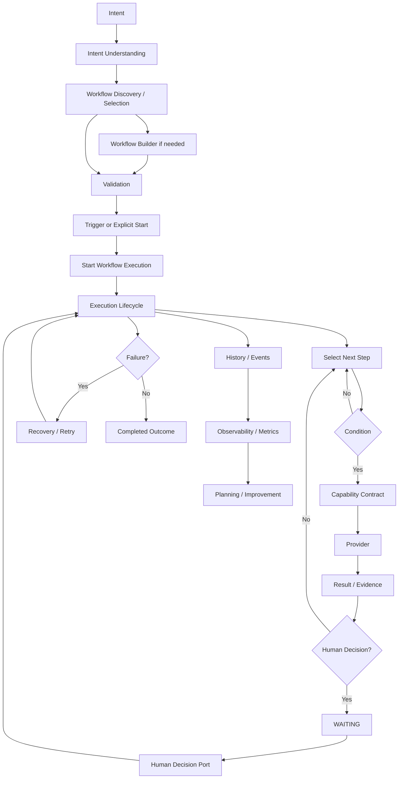

# Automation OS — Logical Workflow Map

Status: **CURRENT ARCHITECTURAL MAP**

## A. Runtime flow

## B. Boundary ownership

| Concern | Authority |
|---|---|
| Intent meaning | Intent/application layer |
| Workflow definition | Workflow domain |
| Workflow construction | Workflow Builder |
| Condition truth | Condition evaluator |
| Trigger matching | Trigger application boundary |
| Execution state | Execution aggregate |
| Capability behavior | Capability contract + provider |
| Human decision | Human Decision Port |
| Lifecycle evidence | History/events |
| Persistence | Repository adapters |
| Recovery | Recovery application boundary |
| Observability | Read-only metrics/projection boundary |
| Planning | Planner / AI layer |
| Distribution | Marketplace |
| External event detection | External integration layer |

## C. What must not happen

- Trigger layer must not own execution lifecycle.
- AI must not directly mutate execution state.
- Provider implementations must not redefine workflow semantics.
- History/events must not become a second lifecycle authority.
- Human interaction must not be an invisible capability side effect.
- Marketplace installation must not bypass validation.
- Recovery must not invent a second execution model.
- Durable persistence must preserve the atomic contracts already established by Phase 7.
- Observability must not become a second execution state store.
- Planning must not bypass deterministic validation or directly control execution lifecycle.

## D. Current implementation position

Completed:
- Core platform
- Phase 7 reliability/hardening
- Builder
- Conditions
- HITL

Completed:
- Scheduling / Triggers
- Capability Providers
- Durable Persistence
- Execution Recovery
- Workflow Versioning
- Observability / Metrics

Upcoming:
- AI Planning
- Marketplace Expansion
- External Event Integration
- Multi-tenancy / Authorization
